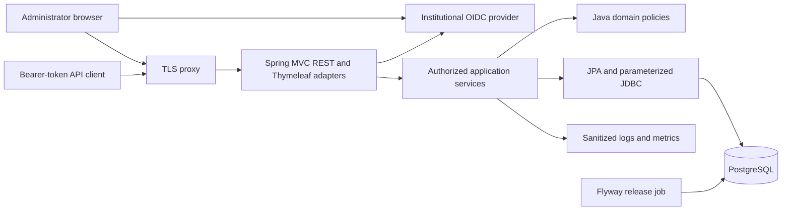
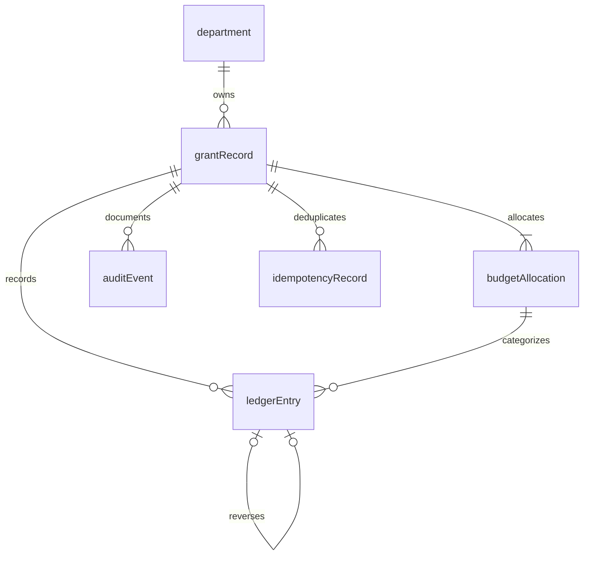
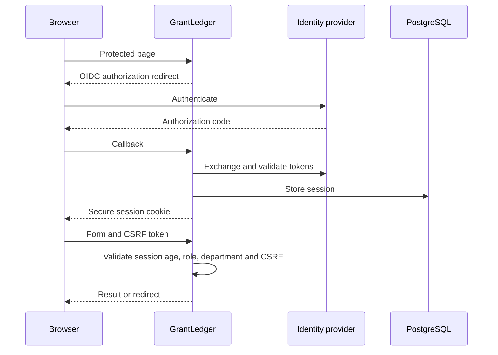

# Architecture



The API chain uses stateless JWT authentication; the browser chain uses OAuth login, sessions and CSRF. Session cookies never grant REST access. Roles and department claims resolve into an immutable actor at the adapter boundary. Application services enforce access before data retrieval or writes.



All business IDs are UUIDs. Monetary columns use NUMERIC(19,2); business amounts are capped at 999999999.99. Dates use DATE; timestamps use TIMESTAMPTZ. Composite foreign keys prevent cross-grant budget and reversal links. Partial unique indexes prevent duplicate expense references and multiple reversals.

```mermaid
sequenceDiagram
  participant caller as Caller
  participant service as Posting service
  participant database as PostgreSQL
  caller->>service: Expense and idempotency key
  service->>database: Check visibility and lock grant
  service->>database: Refresh current grant state
  service->>database: Find prior scoped key
  alt Existing matching request
    database-->>service: Original response
    service-->>caller: Replay 201
  else New request
    service->>database: Read allocations and net expenditure
    service->>service: Check active state, dates and available budget
    service->>database: Insert entry, audit and key; update grant version
    service->>database: Commit together
    service-->>caller: 201 and Location
  end
```

Grant-level pessimistic locks serialize mutations using READ COMMITTED. Refreshing after lock acquisition prevents stale first-level-cache state. Queries and exports use REPEATABLE READ snapshots. No transaction spans interactive sign-in or an HTTP response stream.



The initial institutional topology is one application replica behind a TLS proxy, PostgreSQL on a private network, and internal monitoring. Session storage and database locks permit two replicas without sticky routing. Infrastructure must restrict port 9090; management endpoints are not business-authenticated because monitoring is a separate network trust boundary.
